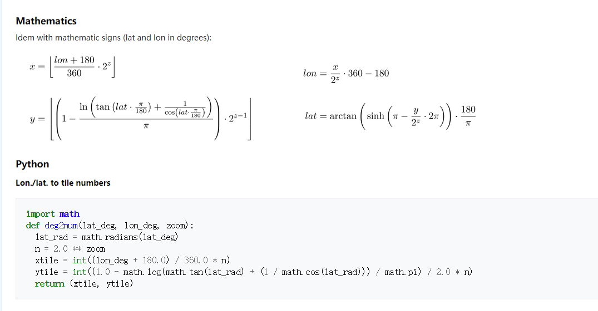

# 天地图切片下载优化

## 需求

- 输入经纬度返回切片索引


## 制作

[本文参考内容](<https://wiki.openstreetmap.org/wiki/Slippy_map_tilenames>)



上述代码不能正常运行


所以对这个代码进行重构


```python
#! /usr/bin/env python
# -*- coding: utf-8 -*-
# __file__: 天地图经纬度转换切片索引
import math


def lng_lat_to_title_index(lng, lat, level):
    """
    天地图经纬度转换切片索引
    :param lng: 经度
    :param lat: 纬度
    :param level: 放大级别
    :return: (切片的x索引,切片的y索引)
    """
    x = (lng + 180) / 360
    title_X = math.floor(x * math.pow(2, level))
    lat_rad = lat * math.pi / 180
    y = (1 - math.log(math.tan(lat_rad) + 1 / math.cos(lat_rad)) / math.pi) / 2
    title_Y = math.floor(y * math.pow(2, level))
    return (title_X, title_Y)


if __name__ == '__main__':
    z = 18
    xy = [120.25871185675187, 30.16739619707534]
    aaa = lng_lat_to_title_index(xy[0], xy[1], z)
    url = 'http://t2.tianditu.gov.cn/DataServer?T=vec_w&x={}&y={}&l={}&tk=a4ee5c551598a1889adfabff55a5fc27'.format(
        aaa[0], aaa[1], z)
    print(url)

```

## 校验

- 校验方式：在地图上绘制当前输入点[120.25871185675187, 30.16739619707534] ，将地图放大到18级，查看这个点所在的图片是否和计算结果重合

- 下图中，蓝色空心圆为输入点，左侧是完整的天地图切片，右侧是计算结果，可以发现点落在右侧图片中，所以认为这个算法是正确的


## 后续

- 本文没有对天地图切片服务做进一步的解析t{0-7} 与放大级别之间的关系

```
http://t{0-7}.tianditu.gov.cn/DataServer?T=vec_w&x={x}&y={y}&l={z}&tk=a4ee5c551598a1889adfabff55a5fc27
```

- 四至框选范围后得到的切片索引配合 [下载天地图切片地图](<https://blog.csdn.net/staHuri/article/details/89487034>)即可进行下载操作
