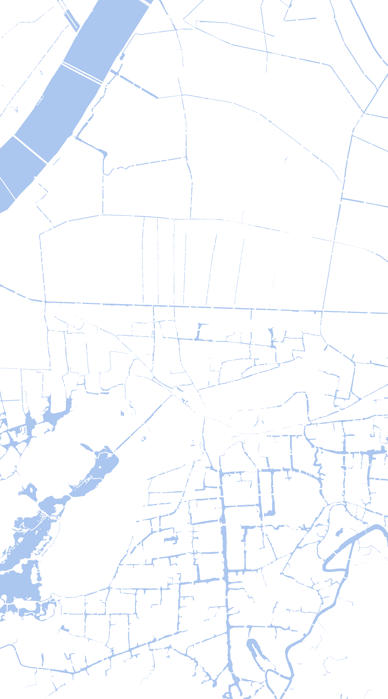
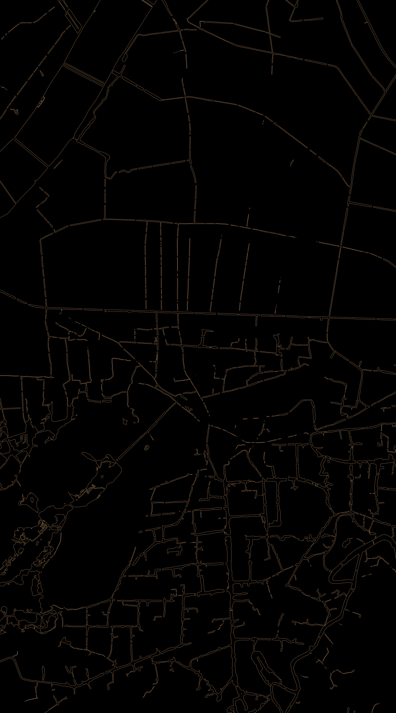

# 天地图切片地图矢量化

## 需求

根据[天地图切片下载](./download_xyzMAP.md),获取到了下图


接下来的工作是将这张图矢量化，暂定描边操作


## 工具

### 方案1

- ArcScan 工具条，自动矢量化的工具
- Reclassify 工具  详细查看[官方文档](<http://desktop.arcgis.com/zh-cn/arcmap/10.3/tools/spatial-analyst-toolbox/reclassify.htm>)


- 下图为直接用原始图进行的一个重分类以及自动矢量化
  - 具体参数 
  - 自动矢量化结果

根据结果来说此图得到的线段并不是最终我想要的。所以需要进一步操作。可能是我参数没有调整正确


### 方案2

- 直接使用 Raster to Polygon 栅格转面


根据结果来看此方案的效果不是很好.


## 实际操作

- 边缘检测，将原图的边缘通过opencv 来进行提取。代码如下，kernel 是一个通用的边缘检测卷积核

```python
import numpy as np
import cv2


def edge(pic_path):
    image = cv2.imread(pic_path)
    kernel = np.array([
        [-1, -1, -1],
        [-1, 8, -1],
        [-1, -1, -1],
    ])

    edges = cv2.filter2D(image, -1, kernel)
    cv2.imwrite("./res/edges.jpg", edges)


if __name__ == '__main__':
    path = './res/river_color_bg.png'
    edge(pic_path=path)
```

- 结果集



- 在上图基础上在进行**方案1**中的操作

在这个成果中数据类型是LineString, 没有做到很好的闭合, 还是需要人为的去做封闭操作。如果有更好的思路可在[issues](https://github.com/wt1187982580/tianditu-python/issues) 中告诉我
